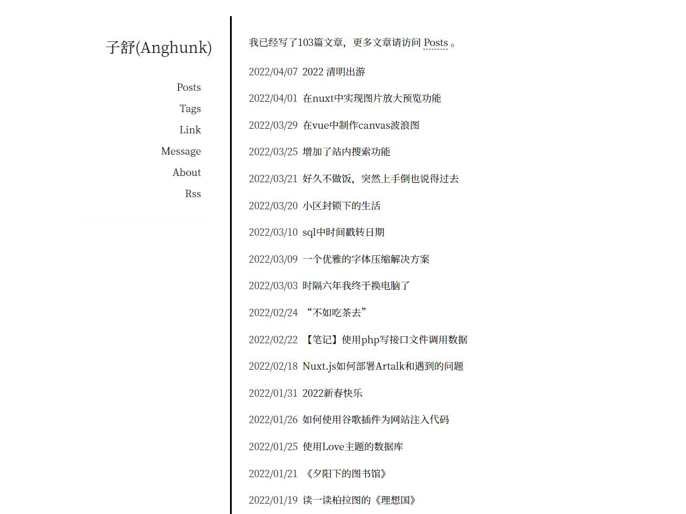

## Typecho-theme-Anghunk

Anghunk一款基于Typecho博客程序的主题，简单整洁是主色调。

演示网址: [https://imhan.cn](https://imhan.cn)

仓库地址: [https://github.com/anghunk/Typecho-theme-Anghunk](https://github.com/anghunk/Typecho-theme-Anghunk)

评论使用artalk，没有使用typecho自带的评论功能，你也可以选择在 `comments.php` 文件中替换成typecho原生评论。

> [如何部署 artalk ?](https://artalk.js.org/) 

新主题可能会有一些小bug，使用时出现问题请提[Issues](https://github.com/anghunk/Typecho-theme-Anghunk/issues)，我会在最快时间内解决。

## 如何使用

下载仓库在本地，上传到 `/usr/themes/`，并把主题文件夹改名为 `Anghunk`，否则可能会出现一些未知的问题。

主题未使用插件，浏览量，运行天数等参数已内置在主题中。

网站已运行天数设置，在`/Anghunk/js/main.js`

```js
var s1 = '2020-06-14'; // 如2020-06-14 ，填入你建立网站的日期。
```

## 图片展示

图片更新不及时，请进入上面的[演示网址](https://imhan.cn)，查看最新的主题。



## LICENSE

[LICENSE](./LICENSE)

[作者: Anghunk](https://imhan.cn)